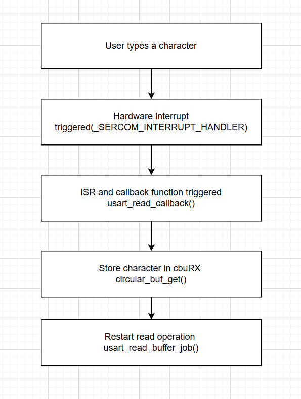
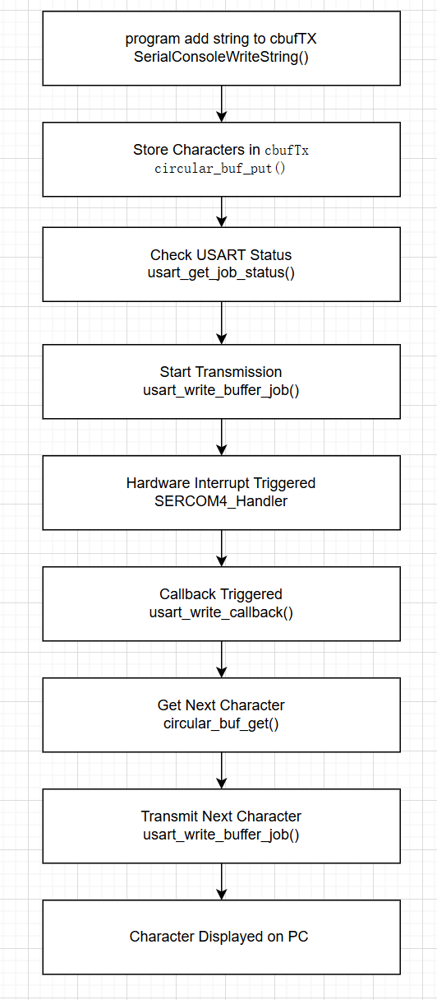
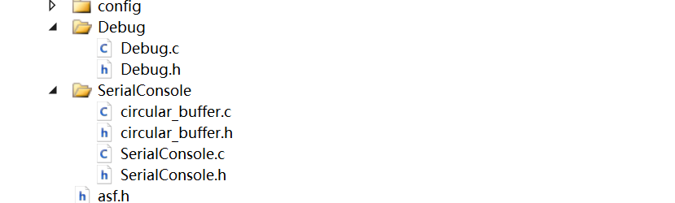

# a07g-exploring-the-CLI

* Team Number:28
* Team Name:AQUA
* Team Members:Venkateswara Rao Koduri & Xiaopeng Jin
* GitHub Repository URL:https://github.com/ese5160/final-project-a07g-a14g-t28-aqua.git
* Description of test hardware: (development boards, sensors, actuators, laptop + OS, etc)

# Task 1 

# Task 2 
## 1. What does “InitializeSerialConsole()” do? In said function, what is “cbufRx” and “cbufTx”? What type of data structure is it?

This function initializes the circular buffers for RX and TX and it configures USART and callbacks. Besides, I can add some code in it to initalize my serial console.

cubfRX is circular buffer used for receiving characters from UART (storing incoming data).

cbufTx is a circular buffer used for transmitting characters via UART (storing outgoing data).

They are circular buffers which means a fixed-size FIFO data structure where the end of the buffer wraps around to the beginning when the buffer becomes full.

## 2. How are “cbufRx” and “cbufTx” initialized? Where is the library that defines them (please list the *Cfile they come from).

They are initialized in the function InitializeSerialConsole with the following lines. 

cbufRx = circular_buf_init((uint8_t *)rxCharacterBuffer, RX_BUFFER_SIZE);
cbufTx = circular_buf_init((uint8_t *)txCharacterBuffer, TX_BUFFER_SIZE);

Thet are defined in SerialCosole.C and the function circular_buf_int() is defined in circuilar_buffer.c

## 3. Where are the character arrays where the RX and TX characters are being stored at the end? Please mention their name and size.

These two arrays are defined as global variables in the SerialConsole.c file.

RX Character Array:
Name: rxCharacterBuffer
Size: RX_BUFFER_SIZE which is defined as 512 bytes.

TX Character Array:
Name: txCharacterBuffer
Size: TX_BUFFER_SIZE which is defined as 512 bytes

char rxCharacterBuffer[RX_BUFFER_SIZE];  // Buffer to store received characters
char txCharacterBuffer[TX_BUFFER_SIZE];  // Buffer to store characters to be sent

The circular buffers (cbufRx and cbufTx) only hold pointers to these character arrays, which means the actual data is stored in rxCharacterBuffer and txCharacterBuffer.

## 4. Where are the interrupts for UART character received and UART character sent defined?

The interrupts are defined at the file sercom_interrupt.c whose address is /ASF/sam0/drivers/sercom/sercom_interrupt.c

The callback functions for UART character received and UART character sent are defined in the file SerialConsole.c.

## 5. What are the callback functions that are called when: a. A character is received? (RX) b. A character has been sent? (TX)

When a character is received. The callback function is usart_read_callback(struct usart_module *const usart_module)

When a character is sent. The callback function is usart_write_callback(struct usart_module *const usart_module);

## 6. Explain what is being done on each of these two callbacks and how they relate to the cbufRx and cbufTx buffers.

usart_read_callback(): It stores the received character (latestRx) in the cbufRx circular buffer using circular_buf_put() and then restarts the read operation with usart_read_buffer_job() for continuous reception.

usart_write_callback(): It retrieves the next character from the cbufTx circular buffer using circular_buf_get() and triggers usart_write_buffer_job() to send it. If cbufTx is empty, no further transmission occurs.

## 7.  Draw a diagram that explains the program flow for UART receive – starting with the user typing a character and ending with how that characters ends up in the circular buffer “cbufRx”. Please make reference to specific functions in the starter code.

The diagram is shown below

## 8. Draw a diagram that explains the program flow for the UART transmission – starting from a string added by the program to the circular buffer “cbufTx” and ending on characters being shown on the screen of a PC (On Teraterm, for example). Please make reference to specific functions in the starter code.

The diagram is shown below

## 9. What is done on the function “startStasks()” in main.c? How many threads are started?

1. print Free Heap Size Before Tasks:Displays available memory using xPortGetFreeHeapSize().
2. Create Command Console Task (vCommandConsoleTask):

    Uses xTaskCreate() to create a task called "CLI_TASK".

    If creation fails, prints an error message.
3. Print Free Heap Size After Tasks:

    Displays remaining memory after creating the task.

One thread is started: The task vCommandConsoleTask.

# Task 3

Here I have finished the debugger module and add the comment in Doxygen style. I divided the code from the SerialConsole file to make the code clear. The following figure shows the structure of my debugger module.

# Task 4

## 1. Question 

### 1.What nets must you attach the logic analyzer to?

To test the function of Uart. We should Connect the Saleae Logic 8 channels to TX, RX, and GND lines on the board. From the datasheet.

### 2. Where on the circuit board can you attach / solder to?

We can easily find Uart_Tx is pin2, Uart_RX is pin3. On the board, there is a section whose name is UART Debug. It has reserved GND, RX and TX pins. 

### 3. What are critical settings for the logic analyzer?

About the setting for the logic analyzer. I set the Saleae analyzer sampling rate to 2 MHz. I configure the saleae software to decode UART with Baud Rate: 115200, Data Bits: 8, Parity: None, Stop Bits: 1.