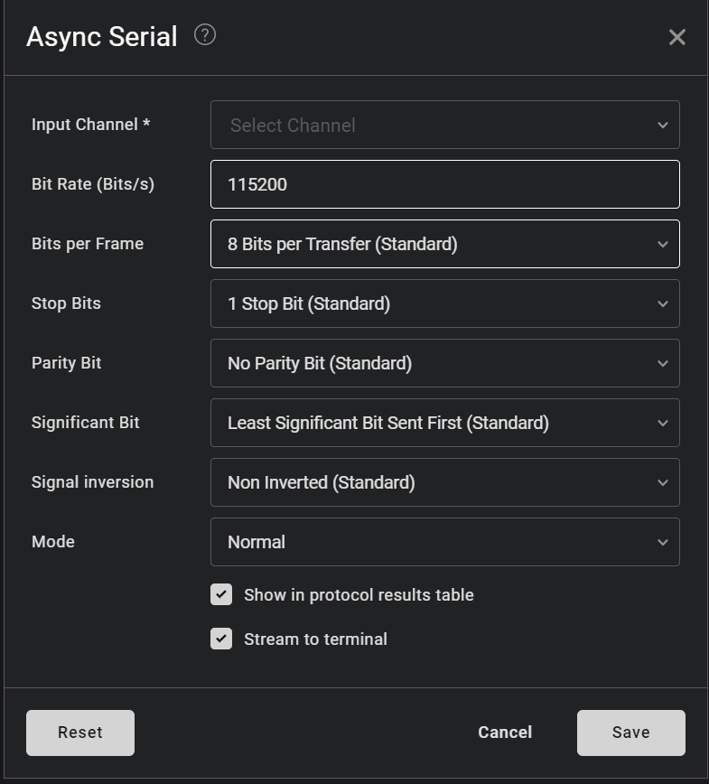
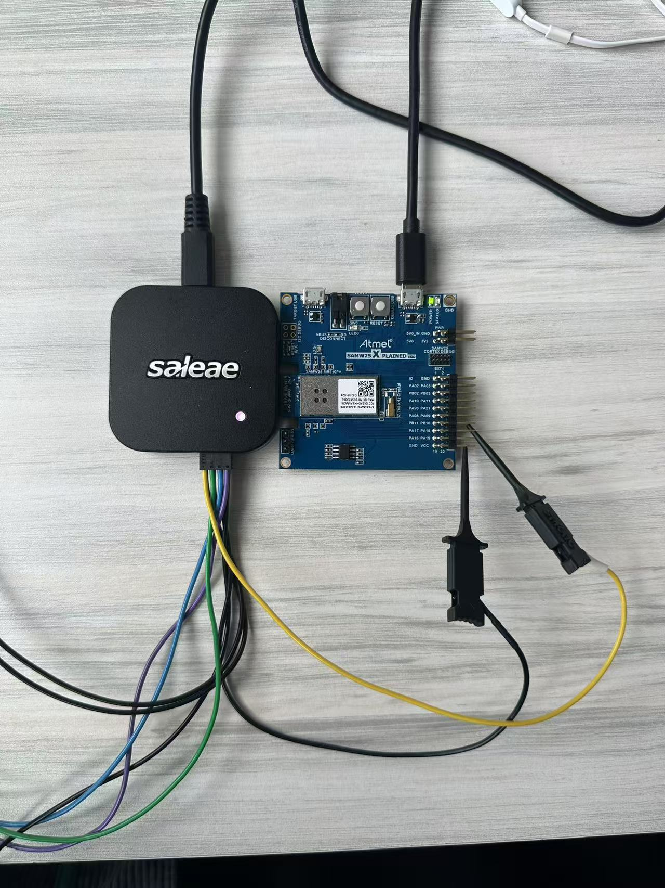
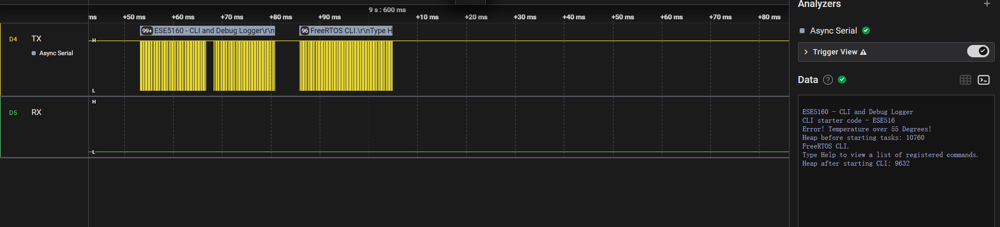
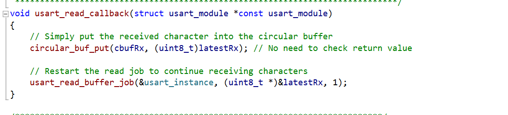
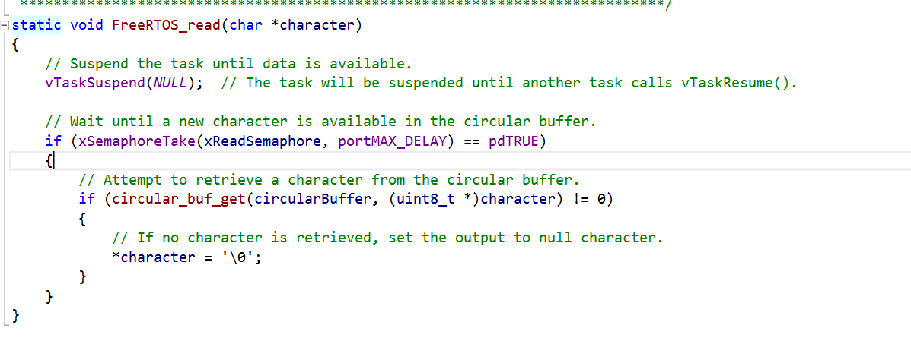

# a07g-exploring-the-CLI

* Team Number:28
* Team Name:AQUA
* Team Members:Venkateswara Rao Koduri & Xiaopeng Jin
* GitHub Repository URL:https://github.com/ese5160/final-project-a07g-a14g-t28-aqua.git
* Description of test hardware: (development boards, sensors, actuators, laptop + OS, etc)

# Task 1

### Part 1

## 1. Hardware Requirements Specification (HRS)

1. HRS 01 (System Composition): The system shall be based on a customized PCB board with SAM W25 microcontroller,  tempertature sensor， pressure sensor and vibrating motor, fan, LCD screen, Total Dissolved Solids (TDS) water quality sensor, ensuring component compatibility.
2. HRS 02 (Temperature): The testing range of the temperature sensor should be between 0-100°C, with an accuracy of ±5°C.
3. HRS 03 (Construction)： Equip a BPA free plastic/steel cylindrical water bottle with a capacity of 500ml and construct an enclosing using 3D printing so that it houses all the sensors(Temperature, Pressure, TDS sensor), SAMW25 MCU and Lithium Ion battery. The aim is to make sure that the enclosing should occupy less than 1/3 of the bottle's volume which amounts to around 120mL. And the bottle internal water capacity should not exceed 500ml in order to prevent overflow and leakages.
4. HRS 04 (Pressure sensor): The pressure sensor should have an accuracy capable of detecting changes in water volume as small as 10ml.
5. HRS 05 (Waterproof requirement): The device should have good sealing, with all components not coming into direct contact with water, ensuring the safety of the drinking water in a bottle.
6. HRS 06 (Fan): The fan installed at the bottom of the bottle is connected to a standard motor(3V, 25595 RPM) and we believe it should have strong power to stir 450ml water assuming mixing with protein powder of 20-30g.
7. HRS07 (TDS water quality detecting): Obtain the TDS readings of water every 3-4 seconds from the sensor and make sure it can be displayed and used to actuate the UV LED in case of poor TDS values.
8. HRS 08 (Connectivity): The voltage and current of all devices must be compatible, including operating voltage, operating current and GPIO voltage etc.
9. HRS 09(Buttons): Equip the device with a manual power supply switch, giving users direct control over its power state and enhancing energy efficiency. Also, equip the device with a switch to control a DC motor which functions as a stirrer and also to control a switch which switches the UV LED at various intervals based on TDS sensor data.
10. HRS 10 : Utilize LED indicators to visually signal a single device status based on the sensor data and user's last use.
11. HRS 11(Safety): Ensure a cutoff/design to incorporate UV sensor to be turned OFF if the user opens the bottle cap in order to prevent user exposure to harmful UV-C light.
12. HRS 12(TFT LCD Display): The LCD display should be mounted along with all other sensors in the enclosing at the bottom of the bottle and should display the user the readings of temperature, and TDS of the water updated every 30 seconds.
13. HRS 13 (Vibration Motor): The system shall include a vibration motor capable of producing sufficient vibration to notify the user to drink water at regular intervals. The motor shall be integrated into the bottle to ensure noticeable vibration without affecting the bottle's stability or usability.

### 2. Software Requirements Specification (SRS)

1. SRS 01 (Data and Visualization): The system shall enable users to access real-time hydration status, water temperature, and usage patterns via a smartphone application.
2. SRS 02 (Control): The application shall allow users to configure and control system settings, including setting hydration goals, customizing LED notifications, and enabling or disabling reminders.
3. SRS 03 (Data Monitoring and Logging): The software shall log all captured data, including water consumption, water temperature, and TDS water quality measurements, to a cloud-based storage for tracking and analysis.
4. SRS 04 (Hydration Notifications): The system shall send push notifications to remind users to drink water based on their set hydration goals, historical trends, and real-time environmental data.
5. SRS 05 (Water Quality Detection): The system shall periodically measure and log water quality using integrated sensors, alerting users when the water quality drops below a predefined threshold.
6. SRS 06 (Hydration Goal Achievement Feedback): The system shall provide feedback on the user’s progress toward their hydration goals, including congratulatory messages when goals are achieved and encouraging messages when goals are missed.
7. SRS 07 (UV LED Status Notification): The smartphone application shall display real-time UV LED status (e.g., active, inactive, or fault) to inform the user when the purification process is in progress or completed.
8. SRS 08 (UV LED Safety Mechanism): The system shall disable the UV LED when the bottle cap is open or not securely fastened, ensuring user safety during UV activation.

# Task 2

## 1. What does “InitializeSerialConsole()” do? In said function, what is “cbufRx” and “cbufTx”? What type of data structure is it?

This function initializes the circular buffers for RX and TX and it configures USART and callbacks. Besides, I can add some code in it to initalize my serial console.

cubfRX is circular buffer used for receiving characters from UART (storing incoming data).

cbufTx is a circular buffer used for transmitting characters via UART (storing outgoing data).

They are circular buffers which means a fixed-size FIFO data structure where the end of the buffer wraps around to the beginning when the buffer becomes full.

## 2. How are “cbufRx” and “cbufTx” initialized? Where is the library that defines them (please list the *Cfile they come from).

They are initialized in the function InitializeSerialConsole with the following lines.

cbufRx = circular_buf_init((uint8_t *)rxCharacterBuffer, RX_BUFFER_SIZE);
cbufTx = circular_buf_init((uint8_t *)txCharacterBuffer, TX_BUFFER_SIZE);

Thet are defined in SerialCosole.C and the function circular_buf_int() is defined in circuilar_buffer.c

## 3. Where are the character arrays where the RX and TX characters are being stored at the end? Please mention their name and size.

These two arrays are defined as global variables in the SerialConsole.c file.

RX Character Array:
Name: rxCharacterBuffer
Size: RX_BUFFER_SIZE which is defined as 512 bytes.

TX Character Array:
Name: txCharacterBuffer
Size: TX_BUFFER_SIZE which is defined as 512 bytes

char rxCharacterBuffer[RX_BUFFER_SIZE];  // Buffer to store received characters
char txCharacterBuffer[TX_BUFFER_SIZE];  // Buffer to store characters to be sent

The circular buffers (cbufRx and cbufTx) only hold pointers to these character arrays, which means the actual data is stored in rxCharacterBuffer and txCharacterBuffer.

## 4. Where are the interrupts for UART character received and UART character sent defined?

The interrupts are defined at the file sercom_interrupt.c whose address is /ASF/sam0/drivers/sercom/sercom_interrupt.c

The callback functions for UART character received and UART character sent are defined in the file SerialConsole.c.

## 5. What are the callback functions that are called when: a. A character is received? (RX) b. A character has been sent? (TX)

When a character is received. The callback function is usart_read_callback(struct usart_module *const usart_module)

When a character is sent. The callback function is usart_write_callback(struct usart_module *const usart_module);

## 6. Explain what is being done on each of these two callbacks and how they relate to the cbufRx and cbufTx buffers.

usart_read_callback(): It stores the received character (latestRx) in the cbufRx circular buffer using circular_buf_put() and then restarts the read operation with usart_read_buffer_job() for continuous reception.

usart_write_callback(): It retrieves the next character from the cbufTx circular buffer using circular_buf_get() and triggers usart_write_buffer_job() to send it. If cbufTx is empty, no further transmission occurs.

## 7.  Draw a diagram that explains the program flow for UART receive – starting with the user typing a character and ending with how that characters ends up in the circular buffer “cbufRx”. Please make reference to specific functions in the starter code.

The diagram is shown below

## 8. Draw a diagram that explains the program flow for the UART transmission – starting from a string added by the program to the circular buffer “cbufTx” and ending on characters being shown on the screen of a PC (On Teraterm, for example). Please make reference to specific functions in the starter code.

The diagram is shown below

## 9. What is done on the function “startStasks()” in main.c? How many threads are started?

1. print Free Heap Size Before Tasks:Displays available memory using xPortGetFreeHeapSize().
2. Create Command Console Task (vCommandConsoleTask):

   Uses xTaskCreate() to create a task called "CLI_TASK".

   If creation fails, prints an error message.
3. Print Free Heap Size After Tasks:

   Displays remaining memory after creating the task.

One thread is started: The task vCommandConsoleTask.

# Task 3

Here I have finished the debugger module and add the comment in Doxygen style. I divided the code from the SerialConsole file to make the code clear. The following figure shows the structure of my debugger module.

# Task 4

## 1. Question

### 1.What nets must you attach the logic analyzer to?

To test the function of Uart. We should Connect the Saleae Logic 8 channels to TX, RX, and GND lines on the board. From the datasheet.

### 2. Where on the circuit board can you attach / solder to?

To find the answer to this question. I first focus on the file SerialConsole.c and find config_usart function.

    config_usart.mux_setting = EDBG_CDC_SERCOM_MUX_SETTING;
	config_usart.pinmux_pad0 = EDBG_CDC_SERCOM_PINMUX_PAD0;
	config_usart.pinmux_pad1 = EDBG_CDC_SERCOM_PINMUX_PAD1;
	config_usart.pinmux_pad2 = EDBG_CDC_SERCOM_PINMUX_PAD2;
	config_usart.pinmux_pad3 = EDBG_CDC_SERCOM_PINMUX_PAD3;

    config->mux_setting = USART_RX_1_TX_2_XCK_3;

    #define SERCOM4_PAD0_DEFAULT  PINMUX_PA12D_SERCOM4_PAD0
    #define SERCOM4_PAD1_DEFAULT  PINMUX_PA13D_SERCOM4_PAD1
    #define SERCOM4_PAD2_DEFAULT  PINMUX_PB10D_SERCOM4_PAD2
    #define SERCOM4_PAD3_DEFAULT  PINMUX_PB11D_SERCOM4_PAD3

Then we can make sure PB10 is TX, and PB11 is RX.

### 3. What are critical settings for the logic analyzer?

About the setting for the logic analyzer.  I configure the saleae software to decode UART with Baud Rate: 115200, Data Bits: 8, Parity: None, Stop Bits: 1. The following figure shows the setting of my analyzer.

## 2. The connection

The connection is shown as the following photo.

## 3. The Screenshot of decoded message

The screenshot of the message is shown in the following.

## 4. Capture file

The capture file is saved in the current folder whose name is A07GTask4.sal

# Task 5

I have completed these two functions usart_read_callback and FreeRTOS_read functions and update them to Github repo.
The following are screenshots of my functions.

[usart_read_callback](usart_read_callback.c)

[FreeRTOS_read](FreeRTOS_read.c)

# Task 6

Here I have completed the coding part. I have updated the new Clithread.c and Clithread.h to Github repo.
[Clithread.c](Clithread.c)

[Clithread.h](Clithread.h)

The link to the video is [https://github.com/ese5160/final-project-a07g-a14g-t28-aqua.git](https://drive.google.com/file/d/1se8SzzI50R0JJp0ZApbUdMW_BFg5L7sH/view?usp=sharing)](https://drive.google.com/file/d/1se8SzzI50R0JJp0ZApbUdMW_BFg5L7sH/view?usp=sharing)](https://github.com/ese5160/final-project-a07g-a14g-t28-aqua.git)
